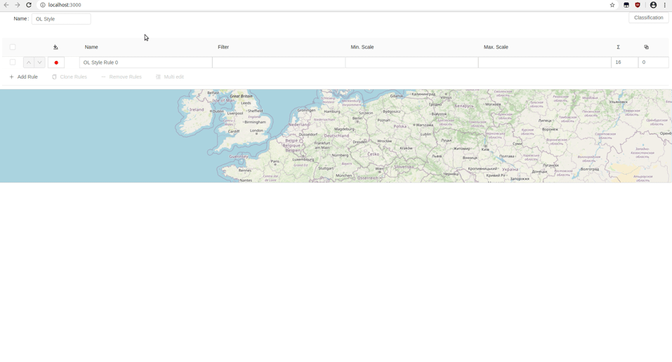

# {{site.data.vars.workshopName}}

Herzlich Willkommen beim **{{ site.data.vars.workshopName }}**. Dieser Workshop soll einen einführenden
Überblick über den GeoStyler als ein webbasiertes Werkzeug zur interaktiven Erstellung von kartographischen Style-Vorschriften für Geodaten geben.

In diesem Workshop werden wir eine einfache Anwendung schreiben, mit der Nutzern das Styling von Geodaten über eine UI ermöglicht wird.

Die fertige Anwendung wird folgendermaßen aussehen:

## Überblick

In diesem Workshop werden wir die drei Kernelemente des GeoStylers kennen lernen. Dabei wird keinerlei Vorwissen zum GeoStyler benötigt.

- [Style Parser](#style-parser-readme) - Übersetzungseinheiten, die die Benutzung (fast) jeden Stilformats erlauben
- [UI Komponenten](#ui-components-readme) - Grafische Komponenten zum Editieren von Stilen
- [Data Parser](#data-parser-readme) - Übersetzungseinheiten, die das Einbinden von Daten erlauben

Jeder Abschnitt baut auf den vorherigen Abschnitten auf. Dadurch empfiehlt es sich, den Workshop beim ersten Mal von
vorne nach hinten durchzuarbeiten.

## Setup

Die folgenden Anweisungen und Übungen setzen voraus, dass bestimmte Anforderungen an euren Computer
erfüllt sind. Bitte stellt sicher, dass folgende Programme installiert sind:

- Einen geeigneten Text Editor, wie z.B. [Atom](https://atom.io/).
- [NodeJS](https://nodejs.org/en/) in Version 12.

## Autoren



- {{ author.name }} ([{{ author.mail }}](mailto:{{ author.mail }}))
  
