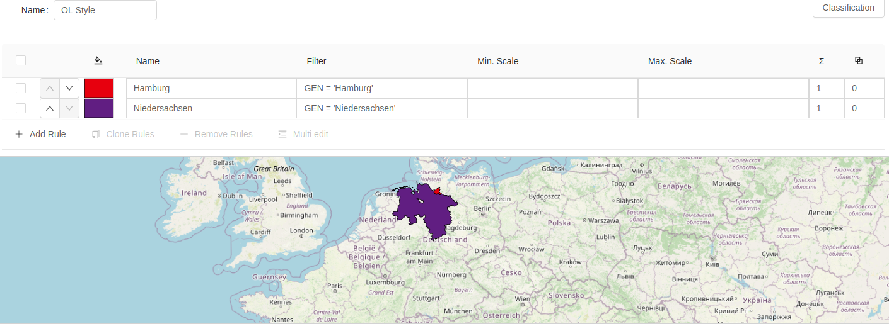

# Data Parser mit UI Verknüpfen

Um attributives Styling zu ermöglichen, muss das gelesene Datenformat der `Style` Komponente über das `data` Property
hinzugefügt werden.

```js
//...
<Style
    data={data}
/>
//...
```

Das Gleiche können wir auch für die `PreviewMap` Komponente machen, damit die Daten auch in der Vorschau dargestellt werden können.

```js
//...
<PreviewMap
    style={style}
    data={data}
/>
//...
```

In unserer Applikation sieht das folgendermaßen aus:

```js
import React, { useState, useEffect } from 'react';
import { Stroke, Fill, Style as OlStyle, Circle } from 'ol/style';
import { Style, PreviewMap } from 'geostyler';
import OlParser from 'geostyler-openlayers-parser';
import WfsParser from 'geostyler-wfs-parser';

import 'antd/dist/antd.css';

const olParser = new OlParser();
const wfsParser = new WfsParser();

function App() {

  const wfsParams = {
    url: 'https://ows.terrestris.de/geoserver/terrestris/ows',
    version: '1.1.0',
    typeName: 'terrestris:bundeslaender',
    srsName: 'EPSG:4326'
  };

  const olStyle = new OlStyle({
      stroke: new Stroke({
          color: 'rgba(255, 255, 255, 1.0)',
          width: 1
      }),
      fill: new Fill({
          color: 'rgba(0, 0, 0, 1)'
      }),
      image: new Circle({
          fill: new Fill({
              color: 'rgba(255, 0, 0, 1.0)'
          }),
          radius: 5
      })
  });

  const [style, setStyle] = useState();
  const [data, setData] = useState();

  useEffect(() => {
    olParser.readStyle(olStyle)
      .then((geostylerStyle) => {
        setStyle(geostylerStyle);
      });

    wfsParser.readData(wfsParams)
      .then((gsData) => {
        setData(gsData);
      });
  }, []);

  return (
    <div>
        <Style
          style={style}
          data={data}
          compact={true}
          onStyleChange={(newStyle) => {setStyle(newStyle)}}
        />
      {
        style && (
          <PreviewMap
            style={style}
            data={data}
          />
        )
      }
    </div>
  );
}

export default App;

```

Dadurch wurden datenabhängige Features wie Klassifizierungen aktiviert. Die Applikation sollte jetzt folgendermaßen aussehen
(beachtet den aktivierten `Classification` Button):

[](../images/attributive.png)